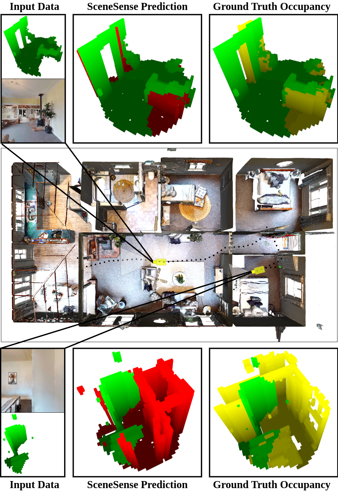
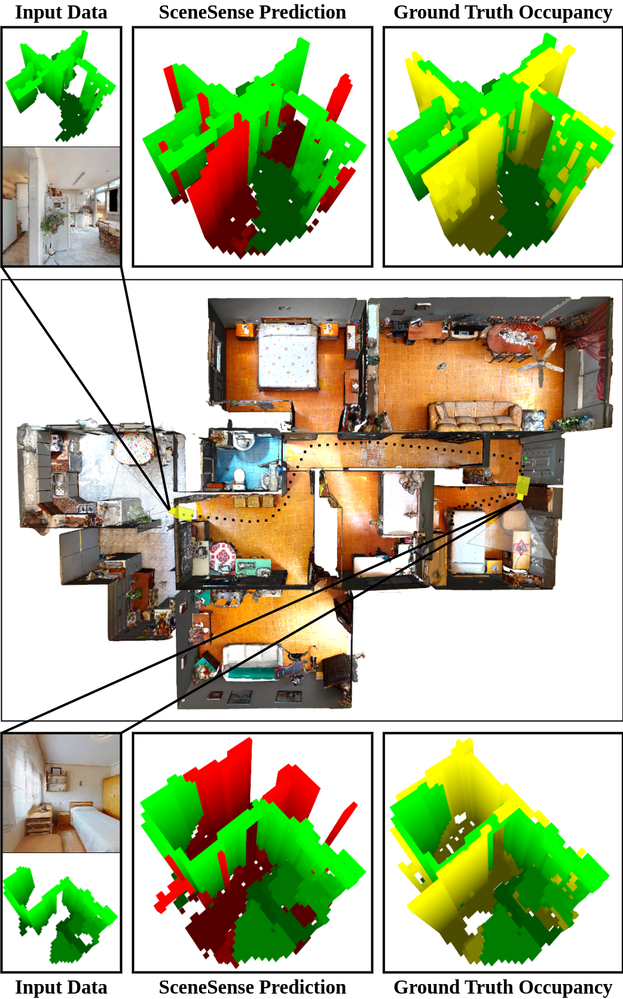

# SceneSense: Diffusion Models for 3D Occupancy Synthesis from Partial Observation

## News

- 6/30 - Accepted for IROS 2024 in Abu Dhabi!

<p align="center">
  
  
</p>

## Tested Specs

Ubuntu 20.04

Cuda 11 or 12 (change spconv-cuXXX to your cuda version in setup.bash)

tested on NVIDIA 3080 and 4070TI super


## Install Instructions

```
git clone git@github.com:arpg/SceneSense.git
```
### Install Dependencies and virtual enviornment

```
./setup.bash /path/to/cloned/directory
```
## Download data

<link>

place data in /SceneSense/SceneSense/data/
### Run Test data
```
source .env/bin/activate
```

```
cd SceneSense/SceneSense
python3 example_prediction.py
```
